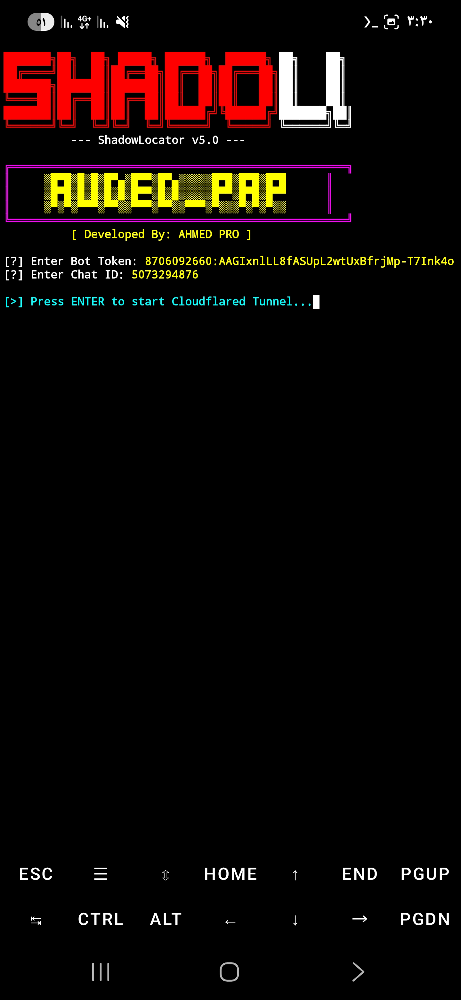

# 📡 ShadowLocator v5.0 
> **Advanced Browser Geolocation Latency & API Accuracy Testing Dashboard.**

---

## 📸 Demo Preview

## 🛡️ Authorization & Ethical Use
**CONFIRMATION:** I have explicit permission and am fully authorized to perform security testing and pentesting on the assets and environments where this tool is deployed. This utility is created strictly for **Authorized Pentesting**, **Educational Research**, and **Device Compatibility Verification**.

---

## 🚀 Technical Overview
**ShadowLocator** is a specialized network utility designed to evaluate the reliability and precision of the Browser Geolocation API across various distributed environments. It provides developers and researchers with a real-time dashboard to monitor API response accuracy and connectivity speed from remote test devices.

---

## 🔥 Key Technical Features
- ✅ **Remote Logging:** Integrated **Telegram Bot API** for real-time asynchronous coordinate logging.
- ✅ **Custom Middleware:** Dynamic runtime configuration for **API Tokens** and **User IDs** for secure data routing.
- ✅ **High-Precision Mode:** Leverages `enableHighAccuracy` parameters for granular GPS verification.
- ✅ **Automated Tunneling:** Built-in **Cloudflared Wrapper** for rapid environment deployment without multiple CLI sessions.
- ✅ **Cross-Platform UI:** Professional HTML5/CSS3 landing page templates for device-specific UI/UX testing.
- ✅ **Developer UI:** Colored terminal output with a professional ASCII banner for AHMED PRO.

---

## 🛠️ Operational Workflow
1. Execute the application controller via **Python/Termux**.
2. Input your secure **Telegram API Credentials** during initialization.
3. Establish a secure **Cloudflare Tunnel** (Auto-generated by the script).
4. Deploy the verification URL to the authorized test endpoint.
5. Monitor real-time API logs in the terminal and via the Telegram uplink.

---

## 📥 Download & Installation

### Termux
git clone https://github.com/Pro90CyberX/ShadowLocator-v5.0.git
cd ShadowLocator-v5.0
python app.py

---

## 📞 Contact & Support

If you have any questions, suggestions, or collaboration ideas, feel free to reach out.

  
  

---

⭐ If you like this project, don’t forget to star the repository!
